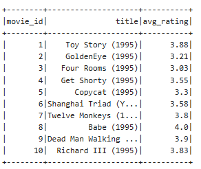
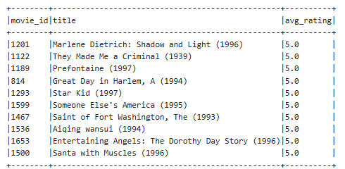
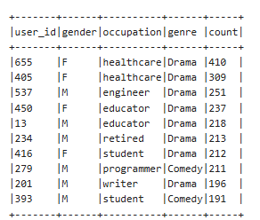
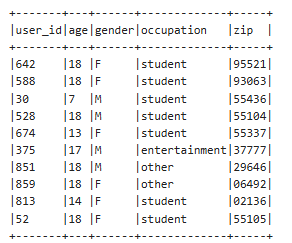
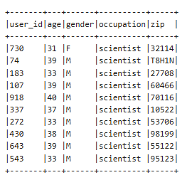

# MovieLens Assignment 3 - PySpark + Cassandra + Zeppelin

This repository presents Assignment 3 for the Data Management course. The task is to analyze the MovieLens 100k dataset using **PySpark**, store the data in **Apache Cassandra**, and run SQL-based queries within a **Zeppelin notebook**.

---

## 📂 Directory Structure

```
movielens-assignment3/
|
├── notebooks/              
│   ├── Assignment3.json     
│   └── Zeppelin.png          
|
├── data/                    
│   └── README.md             ← How to download ml-100k
|
├── results/                 
│   ├── question1_avg_rating.png
│   ├── question2_top10.png
│   ├── question3_fav_genre.png
│   ├── question4_age_under20.png
│   └── question5_scientist.png
|
├── docs/
│   └── REPORT.md             
|
└── README.md
```

---

## 🚀 How to Use

1. **Environment:** Apache Zeppelin + PySpark + Cassandra
2. **Import Notebook:** Upload `Assignment3.json` into Zeppelin
3. **Upload Dataset:** Place MovieLens `u.user`, `u.data`, `u.item`, `u.genre` into HDFS or local path
4. **Run Notebook:** Execute all code cells step-by-step
5. **Match Outputs:** Refer to screenshots in `/results/` for reference

🛠 [Zeppelin + Cassandra Setup Guide](docs/INSTALL.md)
---

## 📊 Implemented SQL Queries

### (i) Average Rating Per Movie
- **Description:** Computes average rating grouped by movie ID
- **Enhancement:** Joined with `movies` table to display `title`
- **Screenshot:**  


### (ii) Top 10 Highest-Rated Movies
- **Description:** Shows 10 movies with highest average ratings
- **Enhancement:** Includes both `title` and `movie_id`
- **Screenshot:**    


### (iii) Active Users' Favorite Genre
- **Description:** For users with ≥50 ratings, find their most rated genre
- **Enhancement:** Added `gender` and `occupation` from `users` table
- **Screenshot:**  


### (iv) Users Under 20
- **Description:** Shows user info where `age < 20`
- **Enhancement:** Sorted by age
- **Screenshot:**  


### (v) Scientists Aged 30–40
- **Description:** Filter `occupation = 'scientist'` and age between 30–40
- **Screenshot:**  


---

##  Notes

- Zeppelin Markdown and visual output included
- Cassandra keyspace used: `movielens`
- All three tables (`users`, `ratings`, `movies`) persisted in Cassandra

📄 [View Full Report](docs/REPORT.md)  
---


